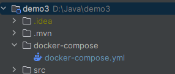
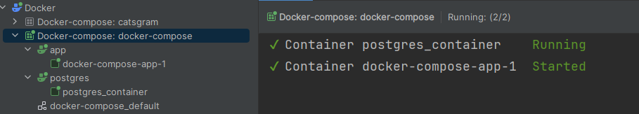

# Меню менеджер

### Инструкция по запуску 

* Как собрать и запустить проект
  * Склонировать репозиторий
  * Открыть файл docker-compose.yml
  
    
  * Запустить выполнение **docker-compose up**
  
    
  * Дождаться загрузки 
  * Проверить корректность запуска контейнеров
  
    

* После запуска контейнеров приложение будет доступно на порту 8080

* Путь к Swagger
    >http://localhost:8080/swagger-ui/index.html

